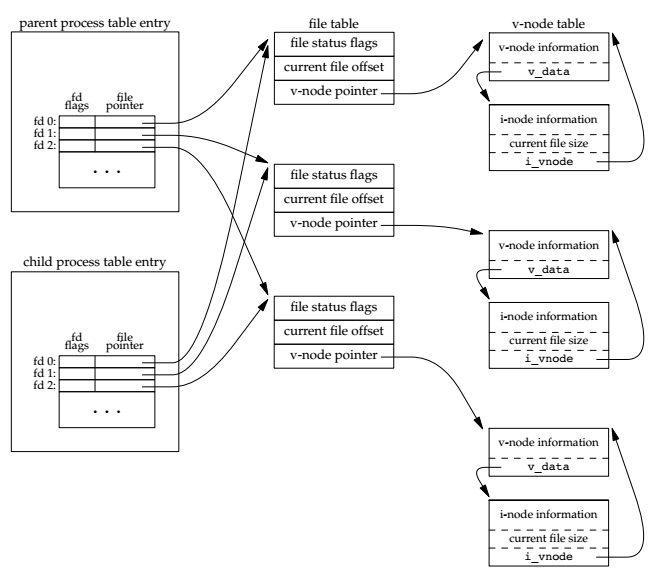

# 进程控制

## 进程标识

每个进程都有一个非负整型表示的唯一进程ID。因为进程ID标识符总是唯一的，常将其用作其他标识符的一部分以保证唯一性。

但是进程ID是可复用的。当一个进程终止后，其进程ID就成为复用的候选者。大多数UNIX系统实现延迟复用算法,使得赋予新建进程的ID不同于最近终止进程所使用的ID。这防止了将新进程误认为是使用同一ID的某个已终止的先前进程。

系统中有一些专用进程，但具体细节随实现而不同：

- ID为0的进程通常是调度进程，常常被称为 `swapper`，该进程是内核的一部分，它并不执行任何磁盘上的程序，因此也被称为系统进程
- 进程ID为1通常是 `init` 进程，`bootstrap` 结束后由内核调用，该进程的程序文件在 `/sbin/init` ，此进程负责在内核 `bootstrap`  后启动一个UNIX系统。`init` 通常读取与系统有关的初始化文件(`/etc/rc*` 文件或 `/etc/inittab` 文件,以及在 `/etc/init.d` 中的文件)，并将系统引导到一个状态(如多用户)。`init` 进程决不会终止。它是一个普通的用户进程，但是它以超级用户特权运行。

返回进程标识符的函数如下：

```
#include <unistd.h> 
pid_t getpid(void);
// Returns: process ID of calling process

pid_t getppid(void);
// Returns: parent process ID of calling process

uid_t getuid(void);
// Returns: real user ID of calling process

uid_t geteuid(void);
// Returns: effective user ID of calling process

gid_t getgid(void);
// Returns: real group ID of calling process

gid_t getegid(void);
// Returns: effective group ID of calling process
```

## fork

一个现有进程调用 `fork` 函数创建一个新的进程：

```
#include <unistd.h> 

pid_t fork(void);
// Returns: 0 in child, process ID of child in parent, −1 on error
```

由 `fork` 创建的新进程被称为子进程(child process) `fork` 函数被调用一次，但返回两次。两次返回的区别是子进程的返回值是0，而父进程的返回值则是新建子进程的进程ID。`fork` 使子进程得到返回值0的理由是：一个进程只会有一个父进程，所以子进程总是可以调用 `getppid` 以获得其父进程的进程ID(进程ID 0总是由内核交换进程使用，所以一个子进程的进程ID不可能为0)

子进程和父进程继续执行fork调用之后的指令。子进程是父进程的副本。

由于在 `fork` 之后经常跟随着 `exec`,所以现在的很多实现并不执行一个父进程数据段、栈和堆的完全拷贝。作为替代,使用了写时复制(copy-on-write，COW)技术。这些区域由父进程和子进程共享,而且内核将它们的访问权限改变为只读。如果父进程和子进程中的任一个试图修改这些区域，则内核只为修改区域的那块内存制作一个副本，通常是虚拟存储系统中的一“页”。

一般来说在 `fork` 之后是父进程先执行还是子进程先执行是不确定的，这取决于内核所使用的调度算法。如果要求父进程和子进程之间相互同步，则要求某种形式的进程间通信。

```
#include <stdio.h>
#include <stdlib.h>
#include <unistd.h>

int globvar = 6;
char buf[] = "a write to stdout\n";

int main()
{
    int var;
    pid_t pid;
    var = 88;
    if (write(STDOUT_FILENO, buf, sizeof(buf) - 1) != sizeof(buf) - 1)
        printf("write error\n");

    printf("before fork:\n");
    if ((pid = fork()) < 0)
        printf("fork error\n");
    else if (pid == 0)
    {
        //@ 子进程
        globvar++;
        var++;
    }
    else
        sleep(2); //@ 父进程

    printf("pid = %d,globvar = %d,var = %d\n", getpid(), globvar, var);
    exit(0);
}
```

上面的程序直接执行和重定向到文件中执行的结果：

```
ubuntu@ubuntu:/mnt/Work//apue$ ./a.out 
a write to stdout
before fork:
pid = 26530,globvar = 7,var = 89
pid = 26529,globvar = 6,var = 88
ubuntu@ubuntu:/mnt/Work//apue$ ./a.out >> out.log 
ubuntu@ubuntu:/mnt/Work//apue$ cat out.log 
a write to stdout
before fork:
pid = 26534,globvar = 7,var = 89
before fork:
pid = 26533,globvar = 6,var = 88
```

可以看到直接在终端输出和重定向到文件中结果并不一样：

- `write` 输出是无缓冲的，并且它是在 `fork` 之前调用的，所以只会输出一次
- 标准输入输出是带缓冲的，输出到终端时是按行缓冲，否则是全缓冲。所以在上面当我们直接输出到终端时，因为是在 `fork` 之前执行的并且是按行缓冲的，所以只打印一次，而重定向时，因为是全缓冲，`fork` 之后，子进程拷贝了父进程的缓冲。所以在每个进程中止的时候，都将缓冲输出。

### 文件共享

`fork` 的一个特性是父进程的所有打开文件描述符都被复制到子进程中。我们说“复制”是因为对每个文件描述符来说,就好像执行了 `dup` 函数。父进程和子进程每个相同的打开描述符共享一个文件表项，因此他们共享的是一个文件偏移量。



如果父进程和子进程写同一描述符指向的文件，但又没有任何形式的同步(如使父进程等待子进程)，那么它们的输出就会相互混合(假定所用的描述符是在 `fork` 之前打开的)。

在 `fork` 之后处理文件描述符有以下两种情况：

- 父进程等待子进程完成
- 父进程和子进程各自执行不同的程序段，它们这件互不干涉，通常用于网络服务器场景

除了打开文件之外，子进程继承父进程的属性有：

- 实际用户ID、实际组ID、有效用户ID、有效组ID
- 附属组ID
- 进程组ID
- 会话ID
- 控制终端
- 设置用户ID标志和设置组ID标志
- 当前工作目录
- 根目录
- 文件模式创建屏蔽字
- 信号屏蔽和处理
- 对任一打开文件描述符的执行时关闭( close-on-exec)标志
- 环境
- 连接的共享存储段
- 存储映像
- 资源限制

父进程和子进程的区别如下：

- `fork` 的返回值不同
- 进程ID不同
- 这两个进程的父进程ID不同：子进程的父进程ID是创建它的进程的ID，而父进程的父进程ID则不变
- 子进程的 `tms_utime`、 `tms_stime`、 `tms_cutime` 和 `tms_ultime` 的值设置为0
- 子进程不继承父进程设置的文件锁
- 在子进程中未处理闹钟被清除
- 在子进程中未处理信号集设置为空集

使 `fork` 失败的原因主要有以下几个：

- 系统中已经有了太多的进程
- 该实际用户ID的进程总数超过了系统限制

 `fork` 有如下两种用法：

- 一个父进程希望复制自己，使父进程和子进程同时执行不同的代码段
- 一个进程要执行一个不同的程序

## vfork

`vfork` 函数的调用序列和返回值与 `fork` 相同，但两者的语义不同：`vfork` 函数用于创建一个新进程，而该新进程的目的是执行一个新程序。子进程并不将父进程的地址空间完全复制到子进程中，子进程会立即调用 `exec` (或 `exit`) ，于是也就不会引用该地址空间，但是子进程调用 `exec` 或 `exit` 之前，它在父进程的空间中运行。

这种优化工作方式在某些UNIX系统的实现中提高了效率,但如果子进程修改数据(除了用于存放 `vfork` 返回值的变量)、进行函数调用、或者没有调用 `exec` 或 `exit` 就返回都可能会带来未知的结果。

`vfork` 和 `fork` 之间的另一个区别是：`vfork` 保证子进程先运行，在它调用 `exec` 或 `exit` 之后父进程才可能被调度运行。

```
#include <stdio.h>
#include <stdlib.h>
#include <unistd.h>

int globvar = 6;
char buf[] = "a write to stdout\n";

int main()
{
    int var = 88;
    pid_t pid;
 
    printf("before fork:\n");
    if ((pid = vfork()) < 0)
        printf("vfork error\n");
    else if (pid == 0)
    {
        globvar++;
        var++;
        _exit(0);
    }
    printf("pid = %d,globvar = %d,var = %d\n", getpid(), globvar, var);
    exit(0);
}
```

输出：

```
before fork:
pid = 32362,globvar = 7,var = 89
```

因为 `vfork` 能够保证子进程在父进程之前先运行。

## exit

不管进程如何终止，最后都会执行内核中的同一段代码。这段代码为相应进程关闭所有打开描述符，释放它所使用的内存。


调用 `exit`、`_exit` 和 `_Exit` 退出进程时，会将退出状态返回。在异常终止情况，内核(不是进程本身)将产生一个指示其异常终止原因的终止状态。在任意一种情况下，该终止进程的父进程都能用 `wait`  或 `waitpid` 函数取得其终止状态。

对于父进程已经终止的所有进程，它们的父进程都改变为 `init` 进程。我们称这些进程由 `init` 进程收养。其操作过程大致是：在一个进程终止时，内核逐个检查所有活动进程，以判断它是否是正要终止进程的子进程，如果是，则该进程的父进程ID就更改为1(`init` 进程的ID)。这种处理方法保证了每个进程有一个父进程。

如果子进程在父进程之前终止，子进程完全消失了，父进程并没有获取子进程的中止状态，此时如何处理呢？其实内核保存每一个中止进程的少量信息，这些信息包括：进程ID，中止状态，进程使用的CPU时间，这些信息将将在父进程调用`wait`  或 `waitpid` 函数时获取到。

在UNIX术语中，一个已经终止但是其父进程尚未对其进行善后处理(获取终止子进程的有关信息、释放它仍占用的资源)的进程被称为僵尸进程(zombie)。`ps` 命令将僵死进程的状态打印为 `Z`。如果编写一个长期运行的程序，它 `fork` 了很多子进程，那么除非父进程等待取得子进程的终止状态，不然这些子进程终止后就会变成僵尸进程。

一个由 `init` 进程收养的进程终止时会发生什么？它会不会变成一个僵尸进程？对此问题的回答是“否”,因为 `init` 被编写成无论何时只要有一个子进程终止，`init` 就会调用一个 `wait` 函数取得其终止状态。这样也就防止了在系统中塞满僵尸进程。


## wait 和 waitpid

当一个进程正常或异常终止时，内核就向其父进程发送 `SIGCHLD` 信号。因为子进程终止是个异步事件(可以在父进程运行的任何时候发生)，所以这种信号也是内核向父进程发的异步通知。父进程可以选择忽略该信号，或者提供一个该信号发生时的处理程序。对于这种信号的系统默认动作是忽略。

调用 `wait` 和 `waitpid` 时进程都发生什么：

- 如果其所有子进程都还在运行则阻塞
- 如果一个子进程已终止，正等待父进程获取其终止状态，则取得该子进程的终止状态立即返回
- 如果它没有任何子进程则立即返回错误

如果进程由于接收到 `SIGCHLD` 信号而调用 `wait`，我们期望 `wait`  会立即返回。但是如果在不确定的时间点调用  `wait`，则进程可能会阻塞。

```
#include <sys/wait.h> 
pid_t wait(int *statloc); 
pid_t waitpid(pid_t pid, int *statloc, int options); 

// Both return: process ID if OK, 0 (see later), or −1 on error
```

两个函数的区别如下：

- 在一个子进程终止前，`wait` 使其调用者阻塞，而 `waitpid` 有一选项可使调用者不阻塞
- `waitpid` 并不等待在其调用之后的第一个终止子进程，它有若干个选项可以控制它所等待的进程

参数 `statloc` 是一个整型指针，如果 `statloc` 不是一个空指针，则终止进程的终止状态就存放在它所指向的单元内。如果不关心终止状态，则可将该参数指定为空指针。中止状态相关的宏：

- `WIFEXITED(status)`：此值为非0表明进程正常结束，此时可通过 `WEXITSTATUS(status)` 获取子进程通过调用 `exit` 、`_exit`、`_Exit` 设置退出状态的低8位
- `WIFSIGNALED(status)`：此值为非0表明进程异常终止，此时可通过 `WTERMSIG(status)` 获取使得进程退出的信号编号 ，有些系统实现中，当  `WCOREDUMP(statue)` 为真时可以判断子进程中止时产生了 core 文件  
- `WIFSTOPPED(status)`：此值为非0表明进程暂停状态，此时可通过 `WSTOPSIG(status)` 获取使得进程暂停的信号编号 
- ` WIFCONTINUED(status)`：此值为非0表明暂停后已经继续运行(XSI 选项，仅 `waitpid` 支持)

```
#include <stdio.h>
#include <stdlib.h>
#include <sys/wait.h>

void pr_exit(int status)
{
    if (WIFEXITED(status))
        printf("normal termination,exit status = %d \n", WEXITSTATUS(status));
    else if (WIFSIGNALED(status))
        printf("abnormal termination,signal number status = %d%s \n", WTERMSIG(status),
#ifdef WCOREDUMP
               WCOREDUMP(status) ? " (core file generated)" : "");
#else
               "");
#endif
    else if (WIFSTOPPED(status))
        printf("child stopped,signal number = %d \n", WSTOPSIG(status));
}

int main(void)
{
    pid_t pid;
    int status;

    if ((pid = fork()) < 0)
        printf("fork error\n");
    else if (pid == 0) //@ 子进程
        exit(7);

    if (wait(&status) != pid)
        printf("wait error\n");
    pr_exit(status);

    if ((pid = fork()) < 0)
        printf("fork error\n");
    else if (pid == 0) //@ 子进程
        abort();       //@ 产生 SIGABRT

    if (wait(&status) != pid)
        printf("wait error\n");
    pr_exit(status);

    if ((pid = fork()) < 0)
        printf("fork error\n");
    else if (pid == 0) //@ 子进程
        status /= 0;   //@ 产生 SIGFPE

    if (wait(&status) != pid)
        printf("wait error\n");
    pr_exit(status);

    return 0;
}
```

首先测试子进程正常退出的情况：

```
normal termination,exit status = 7 
abnormal termination,signal number status = 6 (core file generated) 
abnormal termination,signal number status = 8 (core file generated) 
```

查看信号：

```
kill -l
 1) SIGHUP       2) SIGINT       3) SIGQUIT      4) SIGILL       5) SIGTRAP
 6) SIGABRT      7) SIGBUS       8) SIGFPE       9) SIGKILL     10) SIGUSR1
11) SIGSEGV     12) SIGUSR2     13) SIGPIPE     14) SIGALRM     15) SIGTERM
16) SIGSTKFLT   17) SIGCHLD     18) SIGCONT     19) SIGSTOP     20) SIGTSTP
21) SIGTTIN     22) SIGTTOU     23) SIGURG      24) SIGXCPU     25) SIGXFSZ
26) SIGVTALRM   27) SIGPROF     28) SIGWINCH    29) SIGIO       30) SIGPWR
31) SIGSYS      34) SIGRTMIN    35) SIGRTMIN+1  36) SIGRTMIN+2  37) SIGRTMIN+3
38) SIGRTMIN+4  39) SIGRTMIN+5  40) SIGRTMIN+6  41) SIGRTMIN+7  42) SIGRTMIN+8
43) SIGRTMIN+9  44) SIGRTMIN+10 45) SIGRTMIN+11 46) SIGRTMIN+12 47) SIGRTMIN+13
48) SIGRTMIN+14 49) SIGRTMIN+15 50) SIGRTMAX-14 51) SIGRTMAX-13 52) SIGRTMAX-12
53) SIGRTMAX-11 54) SIGRTMAX-10 55) SIGRTMAX-9  56) SIGRTMAX-8  57) SIGRTMAX-7
58) SIGRTMAX-6  59) SIGRTMAX-5  60) SIGRTMAX-4  61) SIGRTMAX-3  62) SIGRTMAX-2
63) SIGRTMAX-1  64) SIGRTMAX
```

`waitpid` 函数中 `pid` 参数的作用：

- `pid == -1` ：等待任一子进程。此种情况下, `waitpid` 与 `wait` 等效
- `pid > 0`： 等待进程ID与 `pid` 相等的子进程
- `pid == 0`： 等待组ID等于调用进程组ID的任一子进程
- `pid < -1`： 等待组ID等于 `pid` 绝对值的任一子进程

`waitpid` 函数中的 `options` 参数可以是0或者下面宏的或运算结果：

- `WCONTINUED `：如果实现了 job control，那么 pid 指定的子进程在停止后已经继续，但是它的状态没有报告，则返回其状态
- `WNOHANG`：pid 指定的子进程并不是立即可用的，则 `waitpid` 不阻塞，此时其返回值为 0
- `WUNTRACED `：如果实现了  job control，pid 指定的任一进程已处于停止状态，并且其状态自停止以来还未报告过，则返回其状态，`WIFSTOPPED`  宏确定返回值是否对应于一个停止的子进程 

`waitpid` 函数提供了 `wait` 不具备的的三个功能：

- `waitpid` 可以等待一个特定的进程，而 `wait` 则返回任一中止子线程的状态
- `waitpid` 提供了 `wait` 的非阻塞版本，有时希望获取一个子进程的状态，但是并不想阻塞
- `waitpid` 通过 `WCONTINUED ` 和  `WUNTRACED ` 选项支持 job control

 


