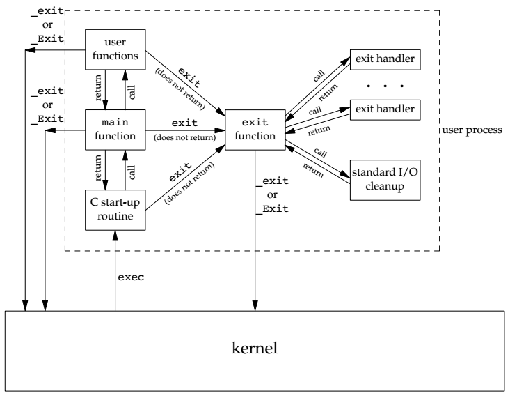
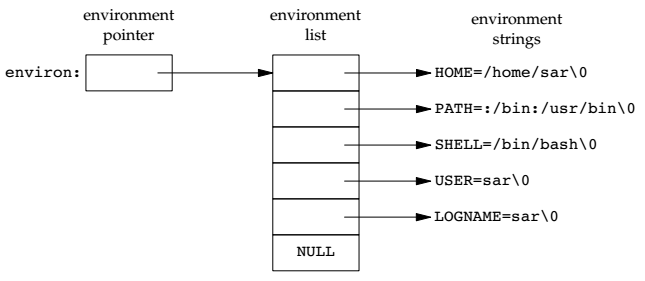
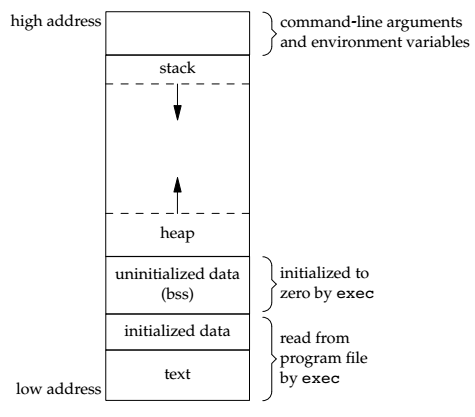
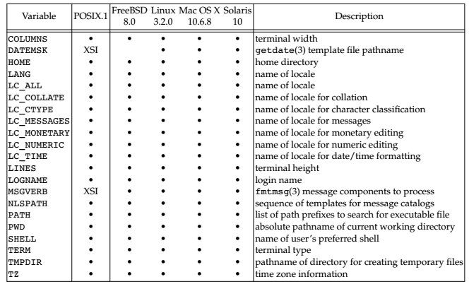

# 进程环境

## main 函数

C 程序总是从main函数开始执行，main 函数的原型是：

```
int main(int argc,char* argv[])
```

- `argc` 是命令行参数的数目
- `argv` 是指向参数的各个指针所构成的数组

当内核执行 C 程序时(使用一个exec函数)，在调用 main 前先调用一个特殊的启动例程。可执行程序文件将此启动例程指定为程序的起始地址—这是由连接编辑器设置的，而连接编辑器则由 C 编译器调用。启动例程从内核取得命令行参数和环境变量。

## 进程终止

有8种方法使得进程终止(termination)，其中5种为正常终止：

- 从 `main` 返回
- 调用 `exit` 
- 调用 `_exit` 或 `_Exit`
- 最后一个线程从其启动例程返回
- 从最后一个线程调用 `pthread_exit`

异常终止有3种方式：

- 调用 `abort`
- 接收到一个信号
- 最后一个线程对取消请求做出响应

3个函数用于正常终止一个程序：

- `_exit` 和 `_Exit` 立即进入内核
- `exit` 则先执行一些清理处理，然后返回内核
  - `exit`函数总是执行一个标准 I/O 库的清理关闭操作:对于所有打开流调用 `fclose` 函数。这造成输出缓冲中的所有数据都被冲洗(写到文件上)

3个退出函数都带一个整型参数,称为终止状态(或退出状态, exit status)。大多数UNIX系统 shell都提供检查进程终止状态的方法。

```
#include <stdlib.h> 
void exit(int status); 
void _Exit(int status);
 
#include <unistd.h> 
void _exit(int status);
```

C 程序启动和中止的情况：



内核使程序执行的唯一方法是调用一个 `exec` 函数。

### atexit

按照 ISO C的规定,一个进程可以登记多至32个函数,这些函数将由exit自动调用。我们称这些函数为终止处理程序(exit handler),并调用 `atexit` 函数来登记这些函数。

```
#include <stdlib.h>
int atexit(void (*func)(void));// Returns: 0 if OK, nonzero on error
```

`exit` 调用这些函数的顺序与它们登记时候的顺序相反。同一函数如若登记多次也会被调用多次。

```
#include <stdio.h>
#include <stdlib.h>

static void exit_handler1(void);
static void exit_handler2(void);

int main(void)
{
    if(atexit(exit_handler2) != 0)
        printf("can not register exit_handler2\n");
    if(atexit(exit_handler1) != 0)
        printf("can not register exit_handler1\n");
    
    printf("main is done\n");
    exit(0);        
}

static void exit_handler1(void)
{
    printf("exit_handler1 is done\n");
}

static void exit_handler2(void)
{
    printf("exit_handler2 is done\n");
}
```

## 命令行参数

当执行一个程序时，调用 `exec` 的进程可将命令行参数传递给该新程序：

```
#include <stdio.h>

int main(int argc,char* argv[])
{
    int i = 0;
    for(;i<argc;i++)
        printf("%d ARG:%s\n",i,argv[i]);
        
    //@ 等价形式
    for(i=0;argv[i]!=NULL;i++)
        printf("%d ARG:%s\n",i,argv[i]);
    return 0;
}
```

## 环境表

每个程序都接收到一张环境表。与参数表一样，环境表也是一个字符指针数组,其中每个指针包含一个以 `null` 结束的 C 字符串的地址。全局变量 `environ` 则包含了该指针数组的地址：



## C 程序的存储空间布局

C 程序一直由以下几个部分组成：

- 代码段。这是由CPU执行的机器指令部分。通常代码段是可共享的，只读的
- 初始化数据段。通常将此段称为数据段，它包含了程序中需明确地赋初值的变量
- 未初始化数据段。通常将此段称为 bss 段，这一名称来源于早期汇编程序一个操作符，意思是“由符号开始的块”( block started by symbol)，在程序开始执行之前，内核将此段中的数据初始化为0或空指针
- 栈。自动变量以及每次函数调用时所需保存的信息都存放在此段中
- 堆。通常在堆中进行动态存储分配



通过 `size` 命令可以查看各个段的大小 (byte)以及总的大小：

```
 text    data     bss     dec     hex filename
 9008    1620    1004   11632    2d70 .\a.out
```

未初始化数据段的内容并不存放在磁盘程序文件中。其原因是内核在程序开始运行前将它们都设置为0。需要存放在磁盘程序文件中的段只有代码段和初始化数据段。

## 共享库

共享库使得可执行文件中不再需要包含公用的库函数，而只需在所有进程都可引用的存储区中保存这种库例程的一个副本。程序第一次执行或者第一次调用某个库函数时，用动态链接方法将程序与共享库函数相链接。

共享库减少了每个可执行文件的长度，但增加了一些运行时间开销。这种时间开销发生在该程序第一次被执行时，或者每个共享库函数第一次被调用时。

共享库的另一个优点是可以用库函数的新版本代替老版本而无需对使用该库的程序重新连接编辑(假定参数的数目和类型都没有发生改变)

gcc 的 `-static ` 选项可以禁止使用共享连接。

## 存储空间分配

- `malloc`：分配指定字节数的存储区。此存储区中的初始值不确定
- `calloc`：为指定数量指定长度的对象分配存储空间。该空间中的每一位(bit)都初始化为0
- `realloc`：增加或减少以前分配区的长度。当增加长度时,可能需将以前分配区的内容移到另一个足够大的区域,以便在尾端提供增加的存储区,而新增区域内的初始值则不确定
- `free`：释放ptr指向的存储空间。被释放的空间通常被送入可用存储区池,以后,可在用上述3个分配函数时再分配

```
#include <stdlib.h>
void *malloc(size_t size);
void *calloc(size_t nobj, size_t size);
void *realloc(void *ptr, size_t newsize);
// All three return: non-null pointer if OK, NULL on error

void free(void *ptr);
```

- 这3个分配函数所返回的指针一定是适当对齐的,使其可用于任何数据对象
- f分配例程通常用 `sbrk` 系统调用实现，该系统调用扩充(或缩小)进程的堆

### 存储空间分配的其他选择

- [libmalloc](https://opensource.apple.com/tarballs/libmalloc/)
- [jemalloc](https://github.com/jemalloc/jemalloc)
- [TCMalloc](https://github.com/google/tcmalloc)

## 环境变量

环境字符串的形式是： `name=value`

UNIX内核并不查看这些字符串，它们的解释完全取决于各个应用程序。

不同版本的 UNIX 对于环境变量的支持，其中的圆点表示 POSIX 标准：



获得环境变量：

```
#include <stdlib.h> 
char *getenv(const char *name); 
// Returns: pointer to value associated with name, NULL if not found
```

设置和取消环境变量：

```
#include <stdlib.h> 
int putenv(char *str);
// Returns: 0 if OK, nonzero on error

int setenv(const char *name, const char *value, int rewrite); 
int unsetenv(const char *name); 
// Both return: 0 if OK, −1 on error
```

- `putenv` ：取形式为`name=value`的字符串，将其放到环境表中。如果 `name` 已经存在，则先删除其原来的定义
- `setenv` ：将 `name` 设置为 `value` 
- `unsetenv` ：删除 `name` 的定义

删除一个字符串很简单，只要先在环境表中找到该指针，然后将所有后续指针都向环境表首部顺次移动一个位置。

增加一个字符串或修改一个现有的字符串就困难得多，环境表和环境字符串通常占用的是进程地址空间的顶部，所以它不能再向高地址方向(向上)扩展，同时也不能移动在它之下的各栈帧,所以它也不能向低地址方向(向下)扩展。

## setjmp 和 longjmp

在 C 中，`goto` 语句是不能跨越函数的，而执行这种类型跳转功能的是函数 `setjmp` 和 `longjmp` 两个函数对于处理发生在很深层嵌套函数调用中的出错情况是非常有用的。

`setjmp` 和 `longjmp` 函数可以看成一个非局部 `goto` 函数。非局部指的是在栈上跳过若干调用帧，返回到当前函数调用路径上的某一个函数中。

实现这种类型的跳转和操作系统中任务切换的上下文切换有点类似，我们只需要恢复 Label 标签处函数上下文即可。函数的上下文包括以下内容：

- 函数栈帧，主要是栈帧指针 BP 和栈顶指针 SP
- 程序指针 PC，此处为指向 Label 语句的地址
- 其它寄存器，这是和体系相关的，在 x86 体系下需要保存有的 AX/BX/CX 等等 callee-regs

```
#include <setjmp.h> 
int setjmp(jmp_buf env); 
// Returns: 0 if called directly, nonzero if returning from a call to longjmp
void longjmp(jmp_buf env, int val);
```

- `setjmp` 函数的功能是将函数在此处的上下文保存在 `jmp_buf` 结构体中，以供 `longjmp` 从此结构体中恢复
  - 参数 `env` 即为保存上下文的 `jmp_buf` 结构体变量
  - 如果直接调用该函数，返回值为 0； 若该函数从 `longjmp` 调用返回，返回值为非零而是由 `longjmp` 函数提供，根据函数的返回值，我们就可以知道 `setjmp` 函数调用是第一次直接调用，还是由其它地方跳转过来的
- `longjmp` 函数的功能是从 `jmp_buf` 结构体中恢复由 `setjmp` 函数保存的上下文，该函数不返回，而是从 `setjmp` 函数中返回
  - 参数 `env` 是由 `setjmp` 函数保存过的上下文
  - 参数 `val` 表示从 `longjmp` 函数传递给 `setjmp` 函数的返回值，如果 `val` 值为0， `setjmp` 将会返回1，否则返回 `val`
  - `longjmp` 不直接返回，而是从 `setjmp` 函数中返回，`longjmp` 执行完之后，程序就像刚从 `setjmp` 函数返回一样

```
//@ jump.c

#include <stdio.h>
#include <stdlib.h>
#include <setjmp.h>

static void f1(int, int, int, int);
static void f2(void);

static jmp_buf jmpbuffer;
static int globval;

int main(void)
{
    int autoval;
    register int regival;
    volatile int volaval;
    static int statval;

    globval = 1;
    autoval = 2;
    regival = 3;
    volaval = 4;
    statval = 5;
    if (setjmp(jmpbuffer) != 0)
    {
        printf("after longjump:\n");
        printf("globval = %d,autoval = %d,regival = %d,volaval = %d,statval = %d\n", globval, autoval, regival, volaval, statval);
        exit(0);
    }

    globval = 95;
    autoval = 96;
    regival = 97;
    volaval = 98;
    statval = 99;

    f1(autoval, regival, volaval, statval);

    exit(0);
}

static void f1(int i, int j, int k, int l)
{
    printf("in f1():\n");
    printf("globval = %d,autoval = %d,regival = %d,volaval = %d,statval = %d\n", globval, i, j, k, l);
    f2();
}

static void f2(void)
{
    longjmp(jmpbuffer, 1);
}
```

编译：

```
gcc .\jump.c
```

执行结果：

```
in f1():
globval = 95,autoval = 96,regival = 97,volaval = 98,statval = 99
after longjump:
globval = 95,autoval = 96,regival = 3,volaval = 98,statval = 99
```

编译：

```
gcc .\jump.c -O
```

执行结果：

```
in f1():
globval = 95,autoval = 96,regival = 97,volaval = 98,statval = 99
after longjump:
globval = 95,autoval = 2,regival = 3,volaval = 98,statval = 99
```

由此可见，优化对于 global变量，static变量和 volatile变量没有啥影响，他们的值还是 `longjmp` 之前的值。

## getrlimit 和 setrlimit

每个进程都有一组资源限制，其中一些可以用 `getrlimit` 和 `setrlimit` 函数查询和更改：

```
#include <sys/resource.h>
int getrlimit(int resource, struct rlimit *rlptr);
int setrlimit(int resource, const struct rlimit *rlptr);
// Both return: 0 if OK, −1 on error
```

 Resouce limit：

```
struct rlimit{ 
	rlim rlim_cur; /* 软限制：当前限制 */ 
	rlim rlim_max; /* 硬限制：rlimcur的最大值 */ 
}; 
```

资源限制的三条准则：

- 任何进程可以将软限制改为小于或等于硬限制
- 任何进程都可以将硬限制降低，但普通用户降低了就无法提高，该值必须等于或大于软限制
- 只有超级用户可以提高硬限制

`resource` 参数可以是下面的选项：

- RLIMIT_AS：进程可用的内存的最大字节数，将会影响 `sbrk` 和 `mmap` 函数
- RLIMIT_CORE：设定最大的core文件，当值为0时将禁止 core 文件，非0时将设定产生的最大 core 文件大小为设定的值
- RLIMIT_CPU：CPU时间的最大量值（秒），当超过此软限制时向该进程发送 SIGXCPU 信号
- RLIMIT_DATA：数据段的最大字节长度，是初始化数据段，未初始化数据段以及堆的总和
- RLIMIT_FSIZE：可以创建的文件的最大字节长度，当超过此软限制时向进程发送 SIGXFSZ
- RLIMIT_MEMLOCK：进程使用 `mlock` 可以锁定内存的最大字节数
- RLIMIT_MSGQUEUE：进程可以为 POSIX 消息队列申请内存的最大字节数
- RLIMIT_NICE：进程 nice 值可以提升到的上限，这将影响它的调度优先级
- RLIMIT_NOFILE：每个进程能够打开的最多文件数。更改此限制将影响到sysconf函数在参数 `_SC_CHILD_MAX` 中的返回值  
- RLIMIT_NPROC：每个实际用户ID所拥有的最大子进程数，更改此限制将影响到 `sysconf` 函数在参数`_SC_CHILD_MAX` 中返回的值
- RLIMIT_RSS：最大驻内存集字节长度(RSS)如果物理存储器供不应求则内核将从进程处取回超过RSS的部份
- RLIMIT_SBSIZE：用户在给定时间内可以使用的 socket 缓冲区的最大字节数

- RLIMIT_NPTS：用户在同一时间打开的伪终端上限
- RLIMIT_STACK：堆栈存储区的最大容量
- RLIMIT_SIGPENDING：进程中排队信号的最大数量
- RLIMIT_SWAP：用户可以使用的 swap 空间的最大字节数
- RLIMIT_VMEM：与 RLIMIT_AS 含义一致

可以通过 `cat /proc/self/limits`  查看相关限制：

```
Limit                     Soft Limit           Hard Limit           Units     
Max cpu time              unlimited            unlimited            seconds   
Max file size             unlimited            unlimited            bytes     
Max data size             unlimited            unlimited            bytes     
Max stack size            8388608              unlimited            bytes     
Max core file size        0                    unlimited            bytes     
Max resident set          unlimited            unlimited            bytes     
Max processes             30733                30733                processes 
Max open files            1024                 1048576              files     
Max locked memory         16777216             16777216             bytes     
Max address space         unlimited            unlimited            bytes     
Max file locks            unlimited            unlimited            locks     
Max pending signals       30733                30733                signals   
Max msgqueue size         819200               819200               bytes     
Max nice priority         0                    0                    
Max realtime priority     0                    0                    
Max realtime timeout      unlimited            unlimited            us  
```

也可以使用 `ulimit` 查看和设置，其选项为：

```
-H 设置硬资源限制. 
-S 设置软资源限制. 
-a 显示当前所有的资源限制. 
-c size:设置core文件的最大值.单位:blocks 
-d size:设置数据段的最大值.单位:kbytes 
-f size:设置创建文件的最大值.单位:blocks 
-l size:设置在内存中锁定进程的最大值.单位:kbytes 
-m size:设置可以使用的常驻内存的最大值.单位:kbytes 
-n size:设置内核可以同时打开的文件描述符的最大值.单位:n 
-p size:设置管道缓冲区的最大值.单位:kbytes 
-s size:设置堆栈的最大值.单位:kbytes 
-t size:设置CPU使用时间的最大上限.单位:seconds 
-v size:设置虚拟内存的最大值.单位:kbytes 
-u <程序数目> 用户最多可开启的程序数目
```

```
#include <stdio.h>
#include <stdlib.h>
#include <sys/resource.h>

#define doit(name) pr_limits(#name, name)

static void pr_limits(char *, int);

int main()
{
#ifdef RLIMIT_AS
    doit(RLIMIT_AS);
#endif

    doit(RLIMIT_CORE);
    doit(RLIMIT_CPU);
    doit(RLIMIT_DATA);
    doit(RLIMIT_FSIZE);

#ifdef RLIMIT_MEMELOCK
    doit(RLIMIT_MEMELOCK);
#endif

#ifdef RLIMIT_MSGQUEUE
    doit(RLIMIT_MSGQUEUE);
#endif

#ifdef RLIMIT_NICE
    doit(RLIMIT_NICE);
#endif

    doit(RLIMIT_NOFILE);

#ifdef RLIMIT_NPROC
    doit(RLIMIT_NPROC);
#endif

#ifdef RLIMIT_NPTS
    doit(RLIMIT_NPTS);
#endif

#ifdef RLIMIT_RSS
    doit(RLIMIT_RSS);
#endif

#ifdef RLIMIT_SBSIZE
    doit(RLIMIT_SBSIZE);
#endif

#ifdef RLIMIT_SIGPENDING
    doit(RLIMIT_SIGPENDING);
#endif

    doit(RLIMIT_STACK);

#ifdef RLIMIT_SWAP
    doit(RLIMIT_SWAP);
#endif

#ifdef RLIMIT_VMEM
    doit(RLIMIT_VMEM);
#endif

    exit(0);
}

static void pr_limits(char *name, int resource)
{
    struct rlimit limit;
    unsigned long long lim;

    printf("%-14s   ", name);
    if (getrlimit(resource, &limit) < 0)
        printf("getrlimit %s error\n", name);
    else
    {
        lim = limit.rlim_cur;
        printf("%10lld  ", lim);
    }

    if (limit.rlim_max == RLIM_INFINITY)
        printf("(infinite)  ");
    else
    {
        lim = limit.rlim_max;
        printf("%10lld  ", lim);
    }

    putchar((int)'\n');
}
```


